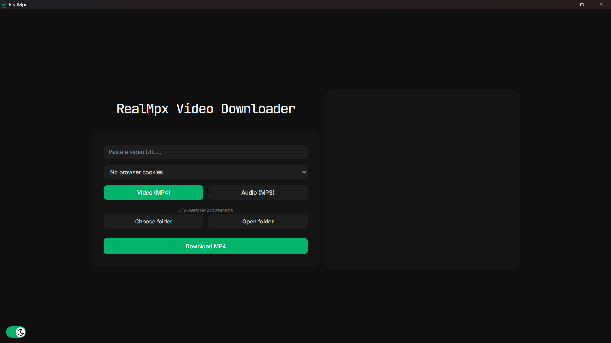
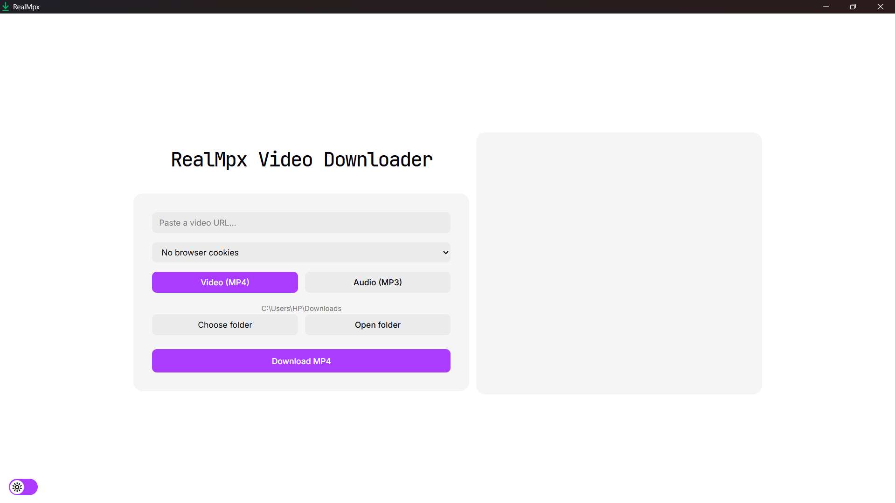

# RealMpx 🎬




**RealMpx** is a lightweight desktop YouTube downloader built with **Tauri, React, TypeScript and Rust**. It uses **yt-dlp** internally to download videos in MP4 or extract audio as MP3.

## ✨ Features

-  Download YouTube videos as **MP4**
-  Extract YouTube audio as **MP3**
-  Automatically selects the highest available MP4 video quality
-  MP3 extraction uses yt-dlp's highest audio quality setting
-  Choose any output folder or use the default Downloads folder
-  Open the selected output folder directly from the app
-  Live yt-dlp output and download logs
-  Cancel download
-  Pause/resume 
-  Dark and light themes
-  Checks whether **yt-dlp** and **FFmpeg** are installed

## 🛠️ Tech Stack

- **React 19 + TypeScript** — user interface
- **Tailwind CSS 4** — styling
- **Vite 8** — frontend tooling
- **Tauri v2** — desktop application framework
- **Rust + Tokio** — backend and process management
- **yt-dlp** — media downloading
- **FFmpeg** — media processing and merging

## 🚀 Get Started

### Requirements

Install **Node.js**, **Rust**, **yt-dlp**, **FFmpeg**, and **Deno**, then make sure they are available in your system `PATH`.

### Development

```bash
git clone https://github.com/codeyahya/realmpx.git
cd realmpx
npm install
npm run tauri dev
```

### Build

```bash
npm run tauri build
```

## 📌 Status

RealMpx is an actively developed personal project. The core downloader works, while features such as better error handling, download progress UI, Windows pause/resume and further code organization can be improved over time.
